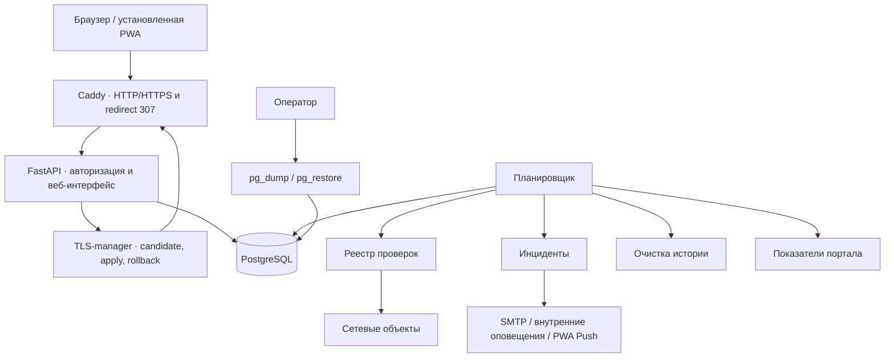

# Архитектура

## Контекст

В версии `0.8.5` система разворачивается через Docker Compose на одной Linux-машине.
FastAPI, PostgreSQL, Caddy и TLS-manager работают в отдельных контейнерах. FastAPI
обслуживает защищённый веб-интерфейс и при включённой настройке запускает один
встроенный планировщик. Caddy публикует HTTP `:8000` и опциональный HTTPS `:443`.



## Границы модулей

| Модуль | Ответственность | Не должен знать |
|---|---|---|
| `web` | HTTP и HTML-представление | детали сетевых проверок |
| `models` | структура хранимых данных | шаблоны и SMTP |
| `checks` | проверка одного объекта | страницы и уведомления |
| `services.monitoring` | выбор целей, выполнение primary/secondary checks и сохранение результата | способ отображения |
| `services.snmp` / `services.snmp_formula` / `services.snmp_graphs` / `services.snmp_thresholds` / `services.snmp_supplies` / `services.snmp_ups` | дополнительная SNMP-телеметрия Target, безопасные производные значения по OID, IF-MIB-инвентарь, Printer-MIB расходники, UPS-MIB RFC 1628 и APC PowerNet, history samples, SVG-графики и пороги | основной статус доступности |
| `services.scheduler` | периодический запуск primary, secondary checks и SNMP | реализация конкретной проверки |
| `notifications` | доставка готового сообщения | логика определения инцидента |
| `services.auth` | пароли, сессии и блокировки входа | страницы и сетевые проверки |
| `services.audit` | единая запись действий | отображение журнала |
| `services.incidents` | подтверждение сбоя, открытие и закрытие инцидента; runtime-маркер краткого неподтверждённого сбоя | SMTP и HTML |
| `services.smtp_settings` | проверка SMTP-настроек и шифрование пароля | HTML и логика инцидентов |
| `services.pagination` | единые границы страниц и безопасные параметры | конкретные модели списков |
| `services.time_display` | перевод UTC в часовой пояс интерфейса | модели и правила мониторинга |
| `services.maintenance` | удаление просроченной истории проверок, метрик и аудита | HTML и сетевые проверки |
| `services.target_checks` / `services.dns_monitoring` / `services.directory_monitoring` | нормализация Multi-check, HTTP Deep Check, DNS A/AAAA и свежести каталога | scheduler и уведомления |
| `services.tls_monitoring` | точная оценка срока сертификата из metadata текущей HTTPS-проверки | доступность HTTPS и сетевые соединения |
| `services.target_health` | пакетное вычисление оперативного health из primary availability, secondary-сервисов и SNMP-инцидентов | scheduler, lifecycle инцидентов и БД-схема |
| `services.site_entry` | одна точка входа площадки и её availability gate | граф зависимостей, incidents и scheduler loop |
| `services.target_order` | сохранённый порядок объектов внутри групп избранных и обычных | сетевые проверки и SMTP |
| `web /wallboard` | защищённое read-only TV-представление текущих результатов, health и incidents | scheduler, отдельные проверки и отдельное хранилище событий |
| `services.target_clone` | перенос на новый объект только конфигурации secondary-check и SNMP-сущностей | результаты, history, incidents и runtime polling |
| `services.site_order` | сохраняемый порядок площадок | сетевые проверки и уведомления |
| `services.system_metrics` | показатели Linux, история и сетевые скорости | объекты и SMTP |
| `templates._chart` / `static.app.js` | единый SVG-стандарт графиков: числовая и временная шкалы, tooltip | расчёт мониторинговых значений |
| `services.reports` | доступность и история объекта | сетевые проверки и уведомления |
| `services.communication` | чат, прочтение, присутствие в диалоге и внутренние оповещения | реализация сетевых проверок |
| `services.push` | подписки и доставка PWA Push | определение состояния объекта |
| `services.backups` | создание, проверка и восстановление резервных копий | HTML-представление |
| `services.tls` | ограниченный клиент TLS-manager | private keys и управление Docker |
| `tls-manager` | проверка/активация TLS-пары, Caddy reload и rollback | база приложения и Docker socket |

## Путь проверки

1. Планировщик с небольшим внутренним интервалом ищет объекты, для которых наступило
   время проверки. Очередь остаётся очередью объектов, а не отдельных сервисов.
2. Для каждого объекта сначала выполняется одна **основная** проверка. Её конфигурация
   остаётся в исторических полях `MonitorTarget` и зеркалируется в primary-запись
   `target_checks`, чтобы существующие формы и отчёты сохраняли совместимость.
3. Результат основной проверки по-прежнему записывается только в `check_results`; эта
   таблица остаётся источником availability, графиков и отчётов доступности объекта.
   `target_check_results` хранит только историю дополнительных проверок, не дублируя
   основной поток данных.
4. Для due batch scheduler сначала выполняет точки входа площадок, затем по их актуальному
   primary-результату пропускает объекты недоступных площадок и отмечает их очередь
   завершённой. Это не создаёт synthetic results или дочерние incidents. Только после
   результата `up` обычной проверки scheduler параллельно запускает включённые дополнительные
   `TargetCheck` и затем разрешает штатный SNMP polling. При `down` или `unknown` primary
   дополнительные проверки и SNMP в этом цикле пропускаются.
5. Дополнительная проверка использует общий интервал объекта, но имеет собственные имя,
   `checker_type`, необязательный address override, port/path, timeout и retries. На один
   объект разрешено до 16 проверок всего. Конфигурация secondary-check версионируется
   внутри Core: stale-результаты старой конфигурации отбрасываются, а серия DOWN для
   открытия инцидента считается только внутри текущей версии. HTTP/HTTPS-сервис может
   opt-in проверять точный код, наличие/отсутствие текста и предел времени ответа одним
   запросом; HTTPS-сервис также может контролировать срок certificate из того же
   соединения. Срок не меняет availability, но использует отдельный TLS incident и
   Target Health. DNS доступен только как secondary-сервис: один системный resolve
   A/AAAA с необязательным ожидаемым IP и пределом времени ответа. DNS не может быть
   основной проверкой объекта. Пустая конфигурация сохраняет прежнее поведение. Результаты дополнительных
   проверок хранятся только в `target_check_results` и не меняют availability объекта.
6. Для подтверждённого сбоя дополнительной проверки создаётся обычный Critical incident
   с `source_kind=check` и `check_id`; успешное восстановление закрывает только этот
   сервисный incident. Благодаря пропуску secondary checks при падении primary один
   выключенный сервер не создаёт новую пачку инцидентов SSH/1С/Web.
7. `TargetHealth` не хранится в БД и не меняет availability. Он пакетно объединяет
   primary availability с текущими secondary-инцидентами и SNMP-проблемами только для
   оперативного UI; `down` основной проверки имеет приоритет над старыми secondary/SNMP
   проблемами.
7. После успешной основной проверки при включённом SNMP выполняется дополнительный SNMP
   GET. Числовая SNMP-история ограничена сроком и `snmp_sample_max_per_target`; IF-MIB
   сохраняет Admin/Oper, RX/TX, errors/discards, а Printer-MIB — уровни расходников.
   SNMP thresholds создают обычные incidents с источником `snmp` и не меняют availability.
8. Все сетевые проверки используют общий semaphore ограничения параллелизма. Runtime
   scheduler-метрики считают фактически выполненные primary и secondary network checks,
   но задержку очереди продолжают измерять относительно срока проверки объекта.

Администратор может запустить внеочередной обход со страницы состояния. HTTP-маршрут
только ставит фоновую задачу и сразу возвращает ответ. `CheckScheduler` использует один
асинхронный lock для планового и ручного обхода, поэтому они не выполняются
одновременно. Повторный ручной запуск отклоняется, пока предыдущий не завершён. Оба
режима используют общий `MonitoringService`, ограничение параллелизма, обработку
инцидентов и уведомления. Проверяются только включённые объекты включённых площадок.

Экран состояния поддерживает необязательное клиентское автообновление. Браузер раз
в 60 секунд повторяет текущий GET-запрос, поэтому сохраняются выбранные фильтры, номер
страницы и размер списка. Состояние переключателя хранится в `localStorage` и не
влияет на других пользователей или устройства. Это только перечитывание результатов
из базы: оно не обращается к объектам и не заменяет защищённый ручной запуск проверки.

Признак избранного является глобальным свойством `MonitorTarget`, потому
что обозначает критичность объекта для инфраструктуры, а не личное предпочтение
пользователя. Администратор изменяет его защищённым действием с записью в аудит.
Запрос состояния сначала применяет выбранные фильтры, затем сортирует избранные записи
перед обычными и только после этого применяет `LIMIT`/`OFFSET`. Фактический статус,
инциденты и уведомления от признака избранного не зависят.

Источник часового пояса хранится в `app_settings` под ключом `display_timezone`.
Значение по умолчанию —
`Europe/Moscow`; изменение доступно администратору в веб-разделе настроек и принимается
только для существующего имени IANA. Преобразование UTC остаётся централизованным в
`services.time_display`. Переменной `MONITORING_DISPLAY_TIMEZONE` нет, чтобы рабочие
настройки интерфейса не дублировались в `.env`.

## Инциденты и уведомления

Инцидент хранится отдельно от подробных результатов. Для основной доступности объекта
одновременно обрабатывается один availability-инцидент; каждая дополнительная проверка
может иметь собственный открытый `check`-инцидент, а SNMP использует свои `source_key`.
Значение `failures_before_incident` задаёт число последовательных результатов `down`
как для primary, так и для каждой secondary-проверки отдельно; `unknown` не подтверждает
новый сбой и не закрывает уже открытый инцидент.

Попытка почтового уведомления отмечается в инциденте до обращения к SMTP. Это исключает
повторные письма при следующих проверках. Все SMTP-реквизиты и отдельный переключатель
канала «Использовать SMTP» управляются из веб-раздела «Настройки» и хранятся в
`app_settings`. Пароль шифруется ключом `MONITORING_SECRET_KEY`; интерфейс и аудит
получают только признак наличия пароля. Изменения применяются к следующему письму без
перезапуска приложения. Ошибка доставки записывается в аудит и журнал без пароля.
Пустое поле пароля при сохранении формы означает «оставить прежний пароль». Тестовая
отправка выполняется принудительно и не зависит от переключателя автоматических
уведомлений: переключатель управляет только письмами по инцидентам. Пользователь
получает нормализованную причину ошибки без исходного ответа SMTP-сервера. Проверенная
базовая схема подключения — порт 587 с STARTTLS; реальные реквизиты в документации не
хранятся.

Поле получателей принимает до 20 адресов, разделённых запятой, точкой с запятой или
новой строкой. Сервис SMTP разбирает и проверяет каждый адрес отдельно, затем хранит
нормализованный список через запятую. В заголовок `To` передаётся весь список;
отправитель остаётся одним адресом.

Действует многоуровневая политика уведомлений. Общая настройка
разрешает или запрещает автоматические уведомления всей системы, а объект получает
собственный флаг `notifications_suppressed`. Уведомление отправляется только при
включённой общей настройке и выключенном флаге объекта. Подавление не влияет на
сетевую проверку, сохранение результата, счётчики и жизненный цикл инцидента. Правило
должно применяться в сервисе инцидентов до выбора конкретного канала, чтобы одинаково
работать для внутреннего центра оповещений, PWA Push и email. Для автоматической
отправки email дополнительно требуется включённый `smtp_enabled`; выключение канала не
стирает SMTP-реквизиты. Ручное тестовое SMTP-письмо не является уведомлением объекта и
не блокируется общим или канальным выключателем.

Штатный интервал объекта равен 300 секундам. Частота внутреннего опроса планировщика не
означает сетевую проверку каждого объекта: она лишь определяет, для каких объектов
наступил срок. Один раз в сутки планировщик удаляет `check_results` и `target_check_results` старше
`history_retention_days`; агрегированные инциденты при этом сохраняются.

## Внутренний чат и удаление пользователей

Сообщения чата ссылаются на обе пользовательские записи и сохраняются, пока существует хотя бы один участник диалога. Удаление учётной записи через интерфейс является логическим: `User.active` выключается, а `User.deleted_at` фиксирует момент удаления. Такая запись скрыта из управления и не может авторизоваться, но остаётся техническим владельцем старых сообщений и ссылок аудита.

`chat_contacts` возвращает активных пользователей и удалённых собеседников только при наличии общей переписки. Удалённый собеседник всегда оффлайн, новые сообщения ему не отправляются. Если живой участник удаляет такой диалог, сообщения удаляются сразу без запроса подтверждения. При удалении второго участника общая переписка двух удалённых пользователей очищается автоматически. Незавершённые `ChatDeletionRequest`, связанные служебные оповещения и Push-подписки удаляемого пользователя очищаются, чтобы сохранённая история не оставалась скрытой без возможности ответа.

Конфигурационный бэкап не включает удалённые пользовательские tombstone-записи; полный бэкап включает их вместе с чатами, чтобы сохранить ссылки сообщений.

## Показатели портала и отчёты

Планировщик с настраиваемым интервалом сохраняет `PortalMetric`: CPU, память, диск,
аптайм, суммарные байты и пакеты. Источник — стандартные Linux `/proc`,
`shutil.disk_usage` и файловая система контейнера; дополнительные агенты не нужны.
Текущая скорость сети вычисляется как разность двух соседних накопительных счётчиков.
История ограничивается настройкой `portal_metric_retention_hours` и очищается вместе с
историей проверок.

Графики формируются как компактные SVG-полилинии на серверной странице без внешней
библиотеки и CDN. Отчёт доступности агрегирует результаты за 24 часа, 7, 30 или 90
дней. Процент равен `up / (up + down)`; `unknown` показан отдельно и не искажает
доступность. Страница истории объекта показывает до 1000 результатов на графике и до
100 последних записей в таблице.

RTSP-проверка соединяется с адресом камеры и отправляет `OPTIONS`, не скачивая и не
декодируя видео. Ответ `401` считается подтверждением доступного защищённого RTSP,
тогда как отсутствующий путь или серверная ошибка считаются недоступностью.

## Динамические формы и PWA

Основные закрытые POST-формы перехватываются общим обработчиком JavaScript. Он
повторяет защищённый запрос с `FormData`, получает серверный результат, заменяет
содержимое `main`, сохраняет прокрутку и открытый редактор и показывает всплывающее
сообщение. Маршруты по-прежнему возвращают обычный `303`, поэтому при отключённом
JavaScript сохраняется полный серверный сценарий.

PWA-манифест и service worker позволяют установить портал на домашний экран. Service
worker кэширует только версионированные статические ресурсы и офлайн-заглушку. HTML с
состоянием, инцидентами и настройками не кэшируется и всегда запрашивается у сервера.

PWA Push хранит подписки в PostgreSQL, но не показывает endpoint и ключи в
административном интерфейсе. При каждом открытии авторизованной PWA текущая
подписка браузера синхронизируется с сервером без повторного запроса разрешения.
Отклонённая Push-сервисом подписка удаляется, а пользователю создаётся внутреннее
уведомление о необходимости переподключить Push на соответствующем устройстве. Для сообщений чата короткоживущая запись
`chat_presence` подтверждает, что получатель видит конкретный диалог. Общий online
статус не подавляет Push: скрытая вкладка, другой раздел или закрытый чат считаются
отсутствием просмотра.

## HTTP и TLS

Caddy является единственной внешней точкой HTTP/HTTPS. Приложение принимает запросы
по HTTP только внутри Docker-сети и доверяет forwarded headers лишь от настроенного
proxy. Разрешённые Host проверяются приложением.

HTTP и HTTPS — независимые режимы. HTTP работает после чистого запуска; HTTPS и
временный redirect `307` включаются отдельными настройками. HSTS не используется.
Cookie имеет `HttpOnly`, `SameSite=Lax` и получает `Secure` для HTTPS-запроса.

Web-приложение отправляет TLS-manager только ограниченное состояние и загруженный
candidate. TLS-manager проверяет PEM, срок, private key, соответствие пары и Caddyfile,
после чего атомарно переключает active-конфигурацию и вызывает Caddy Admin API.
Неуспешный candidate не заменяет active-пару; предыдущая рабочая пара сохраняется для
rollback. Ни web-приложение, ни TLS-manager не имеют Docker socket.

Проверка срока выполняется раз в час. Если сертификат истёк или действует не более
двух суток, redirect снимается в fail-open режиме и блокируется до установки безопасной
пары. Отдельный настраиваемый срок используется для предварительного уведомления.

## Списки и пагинация

Состояние, площадки, объекты, инциденты, пользователи и аудит используют общий объект
`Pagination`, `SortState`, один шаблон панели навигации и общий макрос сортируемого
заголовка. `COUNT`, фильтры, сортировка, `LIMIT` и `OFFSET`
выполняются в базе. URL хранит фильтры, номер и размер страницы; браузер не получает
полный список для последующего обрезания.

Каждый маршрут принимает только разрешённое имя колонки и направление `asc`/`desc`.
Смена сортировки сбрасывает номер страницы, сохраняя фильтры и размер страницы. Журнал
аудита дополнительно фильтруется по поисковой строке, пользователю, действию и типу
объекта.

Список объектов дополнительно фильтруется по признакам подавления уведомлений и
избранного. Значения «Все / Да / Нет» хранятся в URL и сохраняются при сортировке и
пагинации. При ручном
создании полный дубликат определяется по площадке, регистронезависимым названию и
адресу, типу, проверке, порту, интервалу и признаку подавления уведомлений. Активность
существующей записи не позволяет создать её копию.

Администратор может открыть режим «Копировать объект» из строки объекта. Новый объект
создаётся через обычную валидируемую форму, поэтому оператор до сохранения меняет имя,
адрес, порт и другие поля primary-проверки. Затем `services.target_clone` переносит
secondary TargetCheck, SNMP-настройки, ручные OID и формулы, определения интерфейсов,
расходников и SNMP-порогов. Также переносится признак административного отключения,
но не переносится точка входа площадки. Шифротекст SNMP community и пароля каталога передаётся
только внутри той же БД и не расшифровывается, не попадает в HTML и не записывается в
аудит. Результаты, samples, discovered runtime-значения, UPS state, incidents и
нестабильность не копируются; новый объект начинает polling с чистого состояния.

Инциденты фильтруются на сервере по `MonitorTarget.kind` и состоянию `open`/`resolved`;
оба значения остаются в URL и передаются общей пагинации. Время хранится в базе в UTC.
Перед выводом все даты проходят через `services.time_display` и преобразуются в
IANA-зону из `app_settings`, по умолчанию `Europe/Moscow`.

Таблица пользователей сортируется по логину, роли, активности, времени и IP последнего
входа. Таблица активных блокировок на той же странице использует отдельные параметры
`block_sort` и `block_direction`, поэтому сортировки двух списков не перезаписывают друг
друга.

HTML-таблицы не имеют минимальной фиксированной ширины и горизонтальной прокрутки.
На широком экране используется фиксированная раскладка колонок: заголовки компактны,
а колонка действий уменьшена и выровнена вправо. При ширине до 900 пикселей строки
становятся вертикальными блоками с подписями. Редакторы площадки, объекта и пользователя
находятся в отдельной строке `colspan`, поэтому получают полную ширину таблицы и не
растягивают колонку действий.

В вертикальной раскладке фильтров растягивающее поле поиска сбрасывает flex-базу,
поэтому Safari не резервирует под ним лишнюю высоту. Значки получают ширину по
содержимому. Ячейка подробностей аудита снимает настольное ограничение ширины и
использует ту же двухколоночную сетку, что остальные поля карточки. Общая кнопка
«Наверх» появляется после прокрутки, учитывает `safe-area-inset-bottom` и выполняет
плавный возврат к началу страницы.

Удаление объекта сначала удаляет связанные подробные результаты и инциденты. Площадку
можно удалить только пустой; массовое удаление её объектов является отдельным
действием. Эти операции, очистка инцидентов и снятие блокировки доступны только роли
`admin`, защищены CSRF и создают запись аудита.

Карточка инцидента позволяет администратору отключить связанный объект. Действие
изменяет тот же `MonitorTarget.enabled`, что кнопка раздела объектов, но не удаляет и
не закрывает инцидент: его история остаётся явной. Операция защищена CSRF и создаёт
`target.enabled_changed` с источником `incident`.

Статусные значки используют общие семантические классы: успешное или штатное активное
состояние — зелёное, отключённое или аварийное — красное, предупреждение и особый
режим — жёлтые. Служебные раскрытия редакторов имеют нейтральный цвет; названия
сущностей сохраняют основной визуальный вес.

## Резервные копии

Резервная копия PostgreSQL создаётся штатным `pg_dump` в custom-формате. Скрипт сразу
проверяет оглавление через `pg_restore --list`. Восстановление вынесено в отдельный
сценарий с явным подтверждающим аргументом; оно останавливает приложение, заменяет
базу, запускает приложение и проверяет текущую ревизию Alembic.

Конфигурационные и полные `.mxbak` можно импортировать только при точном совпадении
версии приложения. Multi-check configuration
входит в configuration backup, а `target_check_results` — только в full backup. При
импорте старой копии без `target_checks` primary автоматически восстанавливается из
полей `MonitorTarget`. Полная копия содержит эксплуатационные данные и требует точного
совпадения версии приложения. Обычное
обновление выполняет Alembic поверх существующего PostgreSQL volume; удаление volume
не является частью обновления.

## Расширение проверок

Встроенная реализация регистрируется в `checks/__init__.py`. Независимый пакет может объявить entry point:

```toml
[project.entry-points."monitoring.checkers"]
http = "monitoring_http:HttpChecker"
```

Объект должен соответствовать протоколу `Checker`: иметь уникальное поле `name` и
асинхронный метод `check`. Реестр используется и основной, и дополнительными проверками.
После установки или обновления пакета требуется перезапуск процесса, но не миграция или
пересоздание PostgreSQL, если модуль не меняет схему данных.

## Ограничение единственного планировщика

Встроенный планировщик допустим только при одном процессе приложения. Поэтому контейнер запускает один worker. Перед горизонтальным масштабированием планировщик необходимо вынести в отдельный worker; интерфейс `MonitoringService` для этого уже отделён от FastAPI.

## Доступ и безопасность

- ключ приложения поступает из окружения и исключён из репозитория;
- SMTP-пароль хранится в PostgreSQL в зашифрованном виде и не выводится обратно;
- production-запуск запрещён со стандартным секретным ключом;
- пароли хешируются Argon2id;
- сессии хранятся в PostgreSQL, в cookie передаётся только случайный токен;
- роли `admin` и `viewer` проверяются на сервере для каждого закрытого действия;
- изменяющие формы требуют CSRF-токен;
- после пяти ошибок вход блокируется на десять минут;
- cookie имеют `HttpOnly`, `SameSite=Lax` и `Secure` при HTTPS;
- административные действия и события входа записываются в аудит;
- разрешённые HTTP Host задаются явно;
- API-документация в production отключена;
- добавлены CSP, запрет framing, `nosniff`, same-origin referrer и `no-store`;
- приложение запускается в контейнере без root;
- PostgreSQL не публикует порт наружу.
